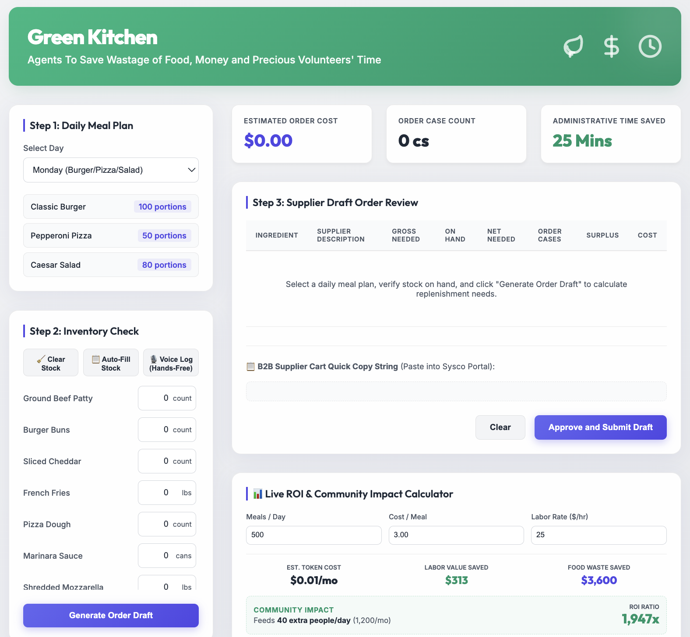
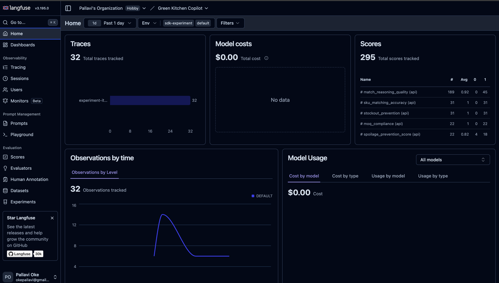
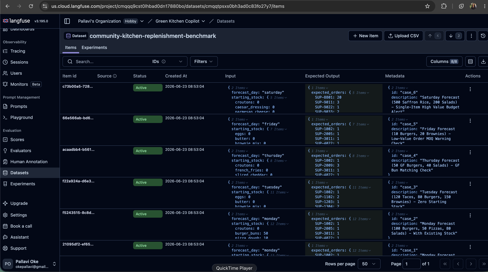

# Green Kitchen Copilot: Waste-Free B2B Replenishment for Community Meal Programs

This is a production-ready AI agent replenishment system designed for community and institutional meal programs.

---

## 1. The "Agents for Good" Mission

Non-profit community kitchens, homeless shelters, and food banks operate on razor-thin grant budgets and donation reserves. In these kitchens, throwing away food due to over-ordering is a double tragedy: it wastes scarce funds that could buy more supplies, and it wastes food that could feed hungry families.

Many developers try to solve bulk ingredient ordering with simple recipe scaling:
`Order = Recipe ingredient weight * Portions`

In a real-world community kitchen, this naive approach fails and causes massive waste:
1. **Starting Stock Confound:** It ignores what is already in the pantry or freezer, leading to unnecessary double-ordering of shelf-stable goods.
2. **Wholesale Rounding Surplus:** B2B distributors (like Sysco or US Foods) sell items in fixed bulk case sizes (e.g., romaine lettuce in 24-head cases). The agent must calculate case-rounded numbers and track the surplus for future menu cycles to prevent fresh items from spoiling.
3. **Dietary & Allergen Safety:** Community kitchens serve highly vulnerable populations, including senior citizens and children with severe food allergies. A mix-up in matching ingredients (e.g., ordering normal wheat buns instead of gluten-free buns) is a critical medical safety hazard.

**Green Kitchen Copilot** solves these problems. It calibrates B2B bulk orders by taking forecasted community portions, asking the kitchen staff for starting stock-on-hand, fuzzy-matching ingredients to a supplier catalog, calculating optimal case rounding, and drafting the final order—all with a secure human-in-the-loop checkpoint for the Executive Director.

---

## 2. Production Tech Stack & Design Patterns
This project implements core production-grade agentic design patterns:
*   **Agentic Framework:** Powered by **LangChain** and **Gemini 2.5 Flash** for orchestrating LLM calls and managing prompt templates.
*   **Structured Outputs:** Uses Pydantic schemas in `copilot/matcher.py` to force the LLM to output clean, predictable JSON SKU matches.
*   **Fuzzy Ingredient Mapping Skill:** Configured as a reusable agent capability in `SKILL.md` to map raw recipe items to B2B catalog SKUs.
*   **Human-in-the-Loop (HITL) Gate:** The agent never orders directly. It submits a draft to an approval checkpoint (`/approve` endpoint) for the director to review, edit, and checkout.
*   **Local LLM-as-a-Judge Evaluations:** Uses Gemini 2.5 Flash as a judge to grade the quality of the agent's matching reasoning.
*   **Production Observability:** Integrated with Langfuse to trace LLM calls, log latencies, track API costs, and version our evaluation datasets.
*   **Spec-Driven Design:** Evaluated against 6 complex real-world edge cases (Allergens, Spoilage Surplus, and MOQ limits).

---

## 3. Product Manager Business Case: 1,947x ROI (Modeled) 📈

For a typical medium-sized community kitchen serving **500 meals per day**, the operational economics of running the Green Kitchen replenishment agent are highly compelling:

*   **Cost of Agent (Gemini 2.5 Flash tokens):** ~$0.00026 per daily run ($\approx$ **$0.008 / month**).
*   **Cost of Hosting (Google Cloud Run):** **~$2.00 / month** (under low-traffic serverless scaling).
*   **Volunteer Time Saved:** Reduces manual spreadsheet ordering and packing-unit calculations from **~30 minutes to under 5 minutes per cycle** (saving ~25 minutes/day, or **12.5 hours / month**). At a modest administrative opportunity cost of $25/hour, this equals **$312.50 / month** in recovered productivity.
*   **Food Budget Restored (Waste Prevention):** Modeled projections show that reducing ordering mistakes and perishable spoilage from standard 10% manual levels to under 2% recovers 8% of the kitchen's raw ingredient food budget ($\approx$ **$3,600 / month** on a $45,000 monthly food spend). This recovered budget is enough to feed an extra **1,200 people in need** every month (40 additional people per day).

| Metric | Tech Cost (Monthly) | Savings/Value (Monthly) |
| :--- | :--- | :--- |
| **LLM Tokens & Serverless Hosting** | $2.01 | - |
| **Volunteer Time Saved (12.5 hrs)** | - | $312.50 |
| **Food Waste Prevention (8%)** | - | $3,600.00 |
| **Total** | **$2.01** | **$3,912.50** |

**ROI Investment Ratio:** 
$$\frac{\text{Savings}}{\text{Tech Cost}} = \frac{\$3,912.50}{\$2.01} \approx \mathbf{1,947x}$$

For every **$1** spent running this serverless agentic workflow, the community kitchen recovers **$1,940** in human resource hours and ingredient wastage!

---

## 4. Project Architecture

```text
                  ┌───────────────────────────────┐
                  │ 1. Soup Kitchen Menu Forecast │
                  └───────────────┬───────────────┘
                                  ▼
 ┌────────────────────────────────────────────────────────────────┐
 │ 2. Replenishment Agent Pipeline                                │
 │                                                                │
 │  ┌───────────────────────┐       ┌───────────────────────────┐ │
 │  │  SKILL.md Prompts     ├──────►│    Case Rounding Engine   │ │
 │  │  (Fuzzy Match SKU)    │       │ (Stock Deduction + Math)  │ │
 │  │  [Pydantic Output]    │       │                           │ │
 │  └───────────────────────┘       └─────────────┬─────────────┘ │
 └────────────────────────────────────────────────┼───────────────┘
                                                  ▼
                  ┌───────────────────────────────┐
                  │ 3. Human-in-the-Loop Triage   │
                  │  (Executive Director Review)  │
                  └───────────────┬───────────────┘
                                  ▼
                  ┌───────────────────────────────┐
                  │ 4. Supplier Cart Auto-Draft   │
                  └───────────────────────────────┘
```

---

## 5. Screenshots & Visuals

Here is how the application runs in production:

### Light Mode UI (High-Contrast for Busy Kitchens)
The web interface features voice input (using the Web Speech API) so kitchen volunteers can log stock hands-free while prepping food.



### Langfuse Tracing Dashboard
Every LLM call, token cost, and execution span is tracked in Langfuse Cloud:



### Dataset Run Evaluations
We backtest prompt changes against 6 edge-case scenarios (spoilage, allergens, and MOQ limits) in our evaluation harness:



---

## 6. How to Setup and Run

### Virtual Environment Setup
1. Clone the repository and navigate to the directory:
   ```bash
   cd cloud_kitchen_copilot
   ```
2. Create the virtual environment and install requirements:
   ```bash
   python3 -m venv .venv
   source .venv/bin/activate
   pip install -r requirements.txt
   ```
3. Set your keys in a `.env` file (never check this file into GitHub!):
   ```ini
   GOOGLE_API_KEY="AIzaSy..."
   LANGFUSE_PUBLIC_KEY="pk-lf-..."
   LANGFUSE_SECRET_KEY="sk-lf-..."
   LANGFUSE_HOST="https://us.cloud.langfuse.com"
   ```

### Running the App
*   **Interactive CLI:**
    ```bash
    python3 copilot/engine.py
    ```
*   **FastAPI Local Web Server:**
    ```bash
    uvicorn main:app --port 8081 --reload
    ```
    Once running, open `http://localhost:8081` in your browser.

### Running Evaluations
*   **Local Test Harness:**
    ```bash
    python3 evals/run_evals.py
    ```
*   **Langfuse Dataset & LLM-as-a-Judge Sync:**
    First, upload the dataset to your workspace:
    ```bash
    python3 evals/upload_dataset.py
    ```
    Then, run the experiment evaluations with the local Gemini judge:
    ```bash
    python3 evals/run_langfuse_evals.py
    ```
